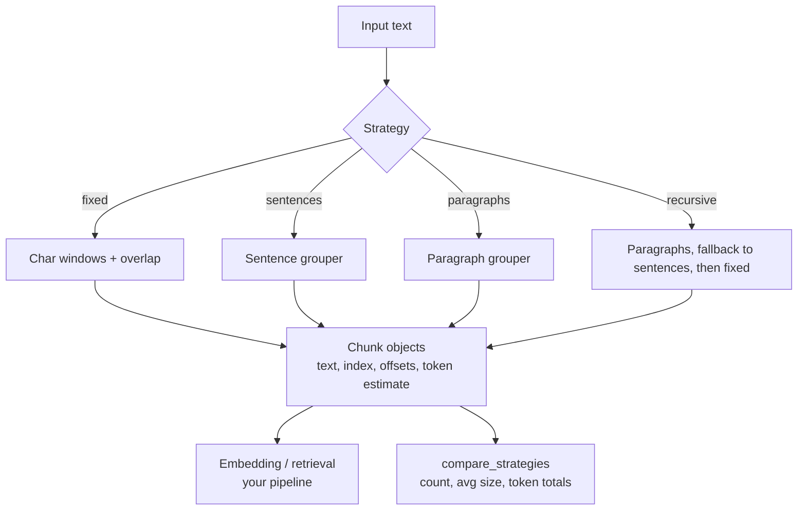

# rag-chunker

Chunk text for RAG pipelines — four strategies, side-by-side comparison, zero dependencies.

Bad chunking is the quiet reason many RAG systems retrieve the wrong passages: chunks that split an idea in half, or mix two topics into one embedding. `rag-chunker` gives you simple, inspectable strategies and a comparison view so you can pick based on your documents, not folklore.

## Setup

```bash
git clone https://github.com/sulaimanvesal/rag-chunker
cd rag-chunker
pip install -r requirements.txt   # only needed for tests (pytest)
```

No API keys. Python 3.10+.

## Usage

Library:

```python
from rag_chunker import chunk_recursive, compare_strategies

chunks = chunk_recursive(open("doc.txt").read(), max_chars=500)
for c in chunks:
    print(c.index, len(c.text), c.token_estimate, c.text[:80])

print(compare_strategies(open("doc.txt").read(), max_chars=500))
```

CLI:

```bash
python -m rag_chunker.cli doc.txt --strategy recursive --max-chars 500
python -m rag_chunker.cli doc.txt --compare
python -m rag_chunker.cli doc.txt --json > chunks.json
```

Demo:

```bash
python demo.py
```

## Strategies

| Strategy | How it splits | Best for |
|----------|---------------|----------|
| `fixed` | Fixed char windows + overlap | Predictable sizing, logs, code |
| `sentences` | Groups whole sentences | Prose where grammar matters |
| `paragraphs` | Groups paragraphs | Articles, docs with structure |
| `recursive` | Paragraphs → sentences → fixed fallback | Default for mixed documents |

## Architecture



## Tests

```bash
pytest -q
```

## License

MIT
